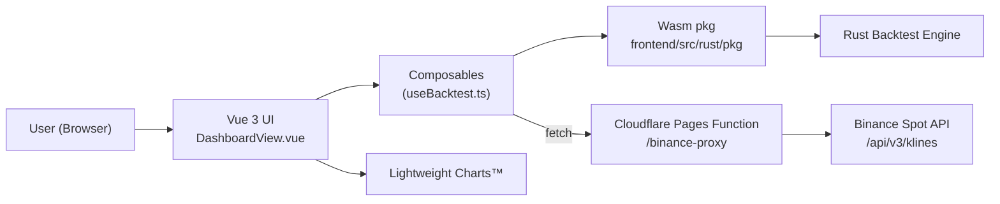
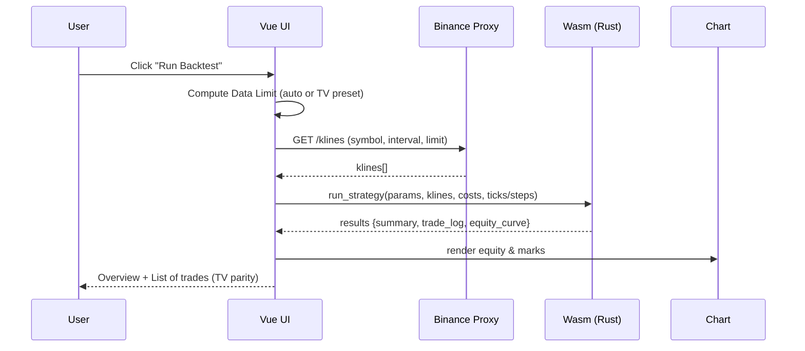

# High-Performance Trading Backtester (Rust/Wasm)

[](LICENSE.md)

A web dashboard for **precise and fast** backtesting of trading strategies. The UI is built with **Vue 3 + TypeScript**, while the computation core runs in a separate **Rust/WebAssembly** (Wasm) engine that executes in the browser. Outputs and trade logs are designed for **parity with TradingView** (Strategy Tester). The frontend plots with **TradingView Lightweight Charts™** for clear and responsive visualization.

> **Note**: The core backtesting engine lives in a private repository: `engan/rust-backtest-proprietary`. This README covers the public frontend and serverless functions.

---

## Table of Contents

* [Features](#features)
* [Architecture](#architecture)
* [Data & Parity with TradingView](#data--parity-with-tradingview)
* [Verified parity (screenshots)](#verified-parity-screenshots)
* [Project Structure](#project-structure)
* [Getting Started](#getting-started)
* [Deployment (Cloudflare Pages)](#deployment-cloudflare-pages)
* [Roadmap](#roadmap)
* [License](#license)

---

## Features

* **High performance**: Rust/Wasm engine runs strategies quickly and deterministically in the browser (built with `wasm-pack`).
* **TradingView parity**: P&L, Max Drawdown, Profit Factor and all trade fields (Qty, Net P&L, Run-up/Drawdown, Cumulative) match TradingView for validated setups.
* **Data source**: Historical klines from **Binance Spot API** (via a serverless proxy).
* **Costs**: Commission (%) and Slippage (ticks) are configurable.
* **Order-size modes**: % of equity, fixed qty/value, explicit qty (x gearing), and **Risk-Based** sizing.
* **UI**: Vue 3 (Composition API) + TypeScript, Vite.
* **Visualization**: Equity/PnL chart rendered with TradingView Lightweight Charts™.
* **TV preset (optional)**: Paste JSON produced by a Pine indicator to override Bars LIVE / Since per timeframe for exact data-window matching.

---

## Architecture





---

## Data & Parity with TradingView

### Verified parity (screenshots)

<figure>
  
  <figcaption><em>Equity & overview parity — The Rust/Wasm backtester (top) reproduces TradingView’s Strategy Tester (bottom) for the same symbol, timeframe and costs. Total P&amp;L, Max equity drawdown and Profit factor align exactly.</em></figcaption>
  </figure>
<br><br>
<figure>
  
  <figcaption><em>Trade-by-trade parity — Every row matches: side, price, position size, Net P&amp;L, Run-up (MFE), Drawdown (MAE) and Cumulative P&amp;L, down to the cent and percent rounding conventions.</em></figcaption>
</figure>
<br>
### Data Limit (automatic)

For the selected timeframe, **Bars LIVE** is computed from a fixed start (01‑Jan‑2024 UTC) to now. We add a **warmup** length for indicators before the first valid trade:

```
warmup     = max(slow_period, max(0, atr_length - 1)) + 2
data_limit = bars_live + warmup + (optional 1 live bar)
```

This mirrors SMA/ATR warmup needs so that backtest entries align with TV’s signal availability.

### TV Preset JSON (override)

Turn on **Enable TV preset JSON** in the UI. When enabled and a JSON preset is pasted (generated by our helper Pine script), Bars LIVE and Since are overridden **per timeframe** to mirror TradingView exactly for your account/plan. The label in TV (Since) is converted to ISO time in the JSON.

Lightweight Charts is purely for visualization; all calculations happen in Rust/Wasm.

---

## Project Structure

```text
rust-backtest/
├── README.md                       # This file
├── package.json                    # (root) pnpm workspace / scripts
├── pnpm-lock.yaml
│
├── frontend/                       # Vue 3 + Vite frontend
│   ├── README.md
│   ├── index.html
│   ├── package.json
│   ├── vite.config.ts
│   ├── env.d.ts / eslint / tsconfig*.json / vitest.config.ts
│   │
│   ├── public/                     # Static assets
│   │   ├── _routes.json            # SPA routing hints (Pages)
│   │   └── favicon.ico
│   │
│   └── src/
│       ├── main.ts, App.vue
│       ├── assets/ (css, illustrations)
│       ├── components/
│       │   ├── PnlChart.vue        # TradingView Lightweight Charts™
│       │   └── EquityChart.vue     # (legacy ApexCharts – no longer used)
│       ├── composables/
│       │   ├── useBacktest.ts      # Calls Wasm and binds results to UI
│       │   └── useKlines.ts        # Helpers for klines
│       ├── router/
│       ├── rust/pkg/               # Wasm artifacts from the private engine
│       ├── services/
│       │   ├── binanceAPI.ts       # REST calls + symbol filters (tick/step)
│       │   └── tvPreset.ts         # Store/load TV preset in localStorage
│       ├── types/common_strategy_types.ts
│       └── views/DashboardView.vue # Main dashboard (Inputs, Properties, Results)
│
└── functions/                      # Cloudflare Pages Functions
    ├── tsconfig.json
    └── binance-proxy/[[path]].ts   # Proxy for Binance API (CORS, rate-limit)
```

---

## Getting Started

### Prerequisites

* Node.js + pnpm
* Basic understanding of **Vue 3** and **Rust/Wasm**

### 1) Build the Wasm engine (private repo)

```bash
# in the parent folder of this project
git clone https://github.com/engan/rust-backtest-proprietary.git   # private
cd rust-backtest-proprietary
wasm-pack build --target web
# copy artifacts into the frontend project
cp ./pkg/*.{js,wasm,d.ts} ../rust-backtest/frontend/src/rust/pkg/
```

### 2) Install dependencies

```bash
pnpm install           # at the repository root
cd frontend && pnpm install
```

### 3) Run locally

```bash
cd frontend
pnpm run dev
```

### 4) Build & preview

```bash
cd frontend
pnpm build
pnpm preview
```

Open the URL printed by Vite (typically `http://localhost:5173` for dev, `http://localhost:4173` for preview).

---

## Deployment (Cloudflare Pages)

* Vite outputs static files to `frontend/dist`.
* SPA routing can be guided by `_routes.json`.
* `functions/binance-proxy/[[path]].ts` is a Pages Function that forwards to Binance and sets CORS headers.

---

## Roadmap

* **Parameter search / Grid search** (batch UI)
* **Monte Carlo simulation** for robustness
* **Walk-Forward Analysis** (periodic re-optimization)
* **Additional strategies** (EMA/VWAP, DMI filter, etc.)

---

## License

MIT – see [LICENSE.md](LICENSE.md).

---

### Notes & References

* TradingView Lightweight Charts™ documentation
* Vue 3 docs (Composition API)
* Binance Spot API – klines and symbol filters (tick/step)
* Rust & WebAssembly – `wasm-pack`
* Cloudflare Pages – `_routes.json` and Pages Functions
