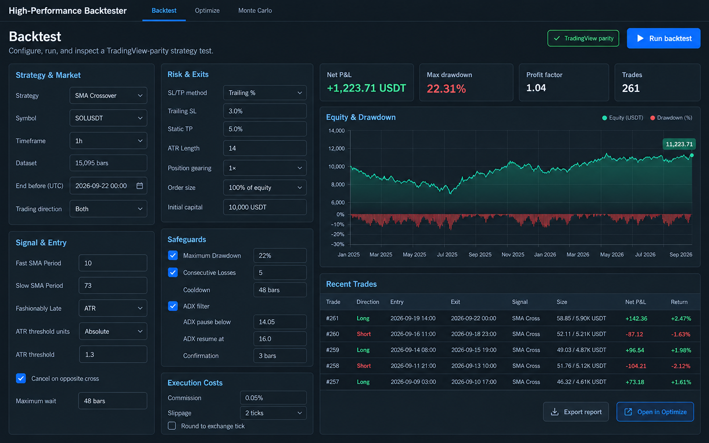
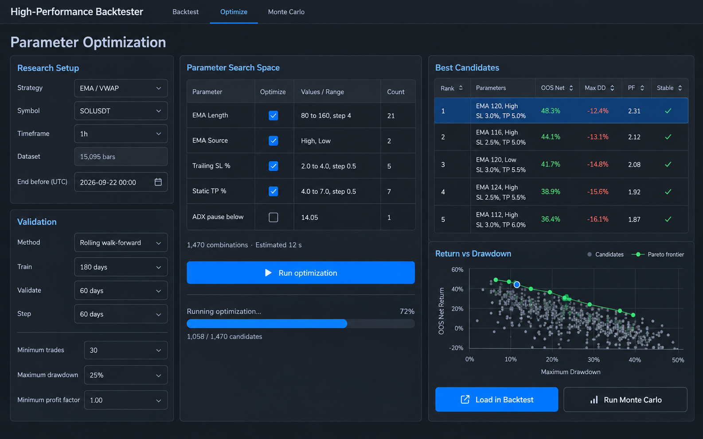
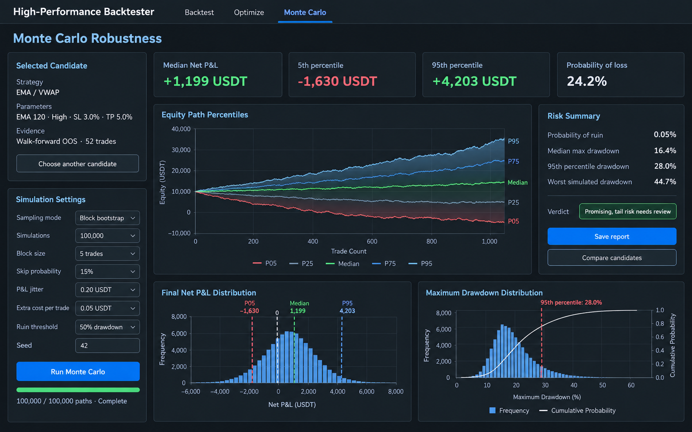

# Research UI and native job workflow

The mockups below remain visual references. The Optimize and Monte Carlo pages
now run real jobs through the native Rust research server.

## Workflow

1. Run a **Backtest**, then use **Open in Optimize** to carry the fields currently
   visible in the Backtest form, including its strategy, requested candle count,
   safeguards, and execution assumptions, into Optimize. This handoff starts
   **Automatic comparison** immediately; opening Optimize directly lets you
   adjust the inputs before pressing **Find robust setups**. If the Backtest
   form was edited after its last run, rerun it before comparing its displayed
   result with Optimize. Walk-forward settings belong to Optimize. The automatic
   run compares Risk-based, Fixed %, Trailing %, and Combined SL/TP on the same
   downloaded candles and execution assumptions. It reserves the newest
   validation-length period as a final holdout. On the earlier research period,
   each walk-forward training window first tests a bounded grid of relevant
   signal, VWAP, and entry choices. Rust then refines the strongest *diverse*
   seeds around their exit values and nearby periods on those same training
   candles. Only the selected refined setup runs on the following validation
   window. ADX, gearing, order size, and safeguards remain at their Backtest
   values; enabled ADX and ATR entry thresholds receive a small local refinement.
   This process does not assume the Backtest SL/TP method is the winner.
   **Manual search** remains available for choosing exact ranges and varying
   other applicable settings. Expand **Base strategy settings** there to inspect
   every carried strategy parameter.
   The manual search table follows the chosen strategy and SL/TP method: EMA/VWAP and
   SMA have their own signal axes, and risk-based, fixed, trailing, and combined
   exits show only the relevant stop/target axes. Suggested ranges include the
   current Backtest values. A warning identifies any current value excluded by
   later edits to a range or categorical selection. After **Open in Optimize**,
   the table initially shows only enabled search axes. **Show additional
   parameters** reveals the other applicable axes if you want to vary them;
   hidden settings retain their Backtest values in every candidate.
2. Let the automatic comparison finish, or run a manual search. The automatic table ranks
   methods by compounded out-of-sample (OOS) equity P&L divided by the larger
   of their worst OOS drawdown or 5%. A method receives **Pass** only with the
   configured minimum OOS trades, positive OOS P&L, drawdown within the
   configured limit, at least two validation windows, and at least half of
   those windows profitable. Select a method to inspect its detailed report.
   **Best Candidates** ranks the top ten broad-search candidates *within that
   method* on the research period; it is not the OOS method ranking. Rust also
   refines a final candidate on that research period. The walk-forward summary
   separately shows which broad seeds led to refined selections and how those
   selections performed in subsequent out-of-sample windows. A numbered row's
   OOS subset is not a fixed-candidate OOS test over every window. The headline
   compounds window returns; the candidate detail sums window P&L, so their
   amounts can differ. OOS equity P&L can include an open position at a window
   boundary; Monte Carlo resamples only closed-trade P&L. The window table shows
   both amounts.
3. If a method passes those OOS checks, the runner applies its final refined
   setup once to the reserved holdout, without using that result to choose a
   method. When both trade samples contain at least 30 closed trades, it also
   runs Monte Carlo automatically. The primary simulation samples the combined
   OOS trades from the adaptive walk-forward selection process. A supplementary
   simulation samples the selected fixed candidate's research-period trades.
   These are different sources of evidence and are labeled separately. The
   holdout trade count is shown explicitly; fewer than 30 trades are limited
   evidence even if its P&L is positive. The Monte Carlo report retains that
   result, and its verdict flags a negative or small final sample so a
   favorable simulation cannot override the untouched check. You can inspect
   other candidates and rerun Monte Carlo manually.
   Monte Carlo stresses the observed trade outcomes and their order. It cannot
   establish that a parameter set was not selected by overfitting the same
   historical data; keep a genuinely untouched later period for that check.
4. Export the automatic comparison to retain all four job reports together, or
   export the selected job alone. Import restores the associated assumptions
   and selection. Automatic comparison can also be restored from browser session
   storage during the same session.

The automatic leader is provisional: the four methods were compared on the
same OOS history, so choosing among them uses that history for selection. The
reserved final period is checked once and is not fed back into the search.
Monte Carlo does not remove selection bias or prove future profitability.

Monte Carlo requires at least 30 closed trades in both evidence sets. A shorter
walk-forward sample is shown in the UI but cannot be simulated, because its
percentiles and tail-risk estimates would be too unstable for a useful
robustness decision. The report keeps the OOS and fixed-candidate summaries
separate and records their trade counts and walk-forward window count.
Automatic runs use the research period for the fixed candidate; manual runs
may use the full dataset.
The endpoint-range panel uses the simulated final equity percentiles. Its
connecting curves are illustrations, not measured intermediate path
percentiles; the histograms contain the actual simulated distributions.

The browser edits and displays research jobs. Candidate searches, walk-forward
validation, and Monte Carlo run in the native Rust runner instead of blocking
the browser or relying on JavaScript workers. The local API exposes job status
and report endpoints under `/research-api`. Vite proxies those requests to the
loopback-only server on `127.0.0.1:8787`.

Every job writes `request.json` and `report.json` below the private engine's
ignored `research-results/<job-id>/` directory. Reports include the engine
version, complete configuration, parameter grid, seed, dataset timestamps, bar
count, requested candle count, and SHA-256 dataset fingerprint. The Dataset
input restores the requested count; the fingerprint records how many candles
were actually fetched. They can also be exported or imported
from the browser. A database is unnecessary for this single-user phase.

Parameter values belong to each job definition. The optimization engine
receives the Backtest base configuration and explicitly selected search axes,
so changing a parameter does not require changing numeric constants in engine
code. Full-dataset eligibility thresholds apply to full-dataset candidate
ranking; training thresholds apply within each walk-forward window. Neither
threshold is a claim that an OOS result passed independently.

## Local development

`npm run dev` (or `pnpm run dev` where pnpm is available) starts both Vite and
the native research server. Starting Vite alone leaves Optimize unable to
submit jobs; the UI reports that port 8787 is unavailable. The private
engine repository must be available as the sibling directory
`../rust-backtest-proprietary`.

## Design references

### Backtest

### Parameter optimization

### Monte Carlo robustness

## Generation prompts

The images were generated as product-design references with the following
prompts.

### Backtest prompt

> Create a high-fidelity desktop web application UI mockup for the Backtest
> screen of the same quantitative crypto backtesting product. Use a wide 16:9
> desktop canvas and the same dark engineering-tool design as the Optimize and
> Monte Carlo concepts. Header: High-Performance Backtester. Tabs: Backtest,
> Optimize, Monte Carlo, with Backtest active. Show Strategy & Market and Signal
> & Entry cards in the left column; Risk & Exits, Safeguards and Execution Costs
> in the middle column; and a results-focused right column with Net P&L, Max
> drawdown, Profit factor and Trades cards, an Equity & Drawdown chart and a
> Recent Trades table. Keep the current SMA, Fashionably Late, SL/TP, position
> sizing, safeguard, data source, parity and cost settings. Include TradingView
> parity status, Run backtest, Export report and Open in Optimize actions. Make
> text legible, alignment precise, and omit logos, people, watermarks and device
> frames.

### Parameter optimization prompt

> Create a high-fidelity desktop web application UI mockup for a quantitative
> crypto backtesting tool. This is a product design concept, not a marketing
> image. Use a wide 16:9 desktop canvas and a dark engineering-tool theme with
> charcoal backgrounds, lighter cards, thin gray borders, muted light-blue
> section headings, white text, gray secondary text, blue actions and green/red
> chart accents. Header: High-Performance Backtester. Tabs: Backtest, Optimize,
> Monte Carlo, with Optimize active. Show Parameter Optimization with Research
> Setup and rolling walk-forward Validation on the left; an editable Parameter
> Search Space table, combination estimate, Run optimization button and progress
> in the center; and ranked Best Candidates plus a Return vs Drawdown scatter
> plot and Pareto frontier on the right. Use EMA / VWAP, SOLUSDT, 1h, 15,095
> bars, and editable axes for EMA Length, EMA Source, Trailing SL %, Static TP %
> and ADX pause below. Include Load in Backtest and Run Monte Carlo actions. Make
> text legible, alignment precise, and omit logos, people, watermarks and device
> frames.

### Monte Carlo prompt

> Create a high-fidelity desktop web application UI mockup for the Monte Carlo
> screen of the same quantitative crypto backtesting tool, using the same wide
> dark engineering-tool design. Header: High-Performance Backtester. Tabs:
> Backtest, Optimize, Monte Carlo, with Monte Carlo active. Show Monte Carlo
> Robustness. On the left, show the selected EMA / VWAP candidate, walk-forward
> OOS evidence and editable settings for block bootstrap, 100,000 simulations,
> block size, skip probability, P&L jitter, extra cost, ruin threshold and seed.
> In the main area show KPI cards, an Equity Path Percentiles fan chart, a Final
> Net P&L Distribution histogram, a Maximum Drawdown Distribution chart and a
> Risk Summary with probability of ruin and drawdown percentiles. Include Save
> report and Compare candidates actions. Make text legible, alignment precise,
> and omit logos, people, watermarks and device frames.
